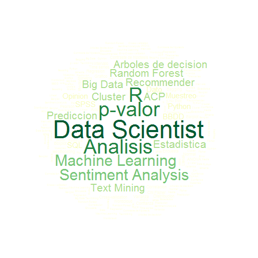

Course Project: Shiny Application and Reproducible Pitch
========================================================
author: Fernando Lopez
date: 5 June 2017
autosize: true

Introduction
========================================================

This is the reproducible pitch presentation prepared to present the Shiny application made for Developing Data Products week 4 course project.

The Shiny application shows a Wordcloud of my skills a Data Scientist to show in my (future) online resume.

Data used is a collection of words related to Data Science & Statistics.

For the shiny application, please visit <https://flopeko.shinyapps.io/wordcloud/> 

Shiny wordcloud app
========================================================

The Shiny app will ask for two values:

- Language: this will display in the plot words in the selected language.
- Palette: for selecting the favourite color palette

Wordcloud & RColorBrewer libraries need to be loaded. More information on palettes in  <https://www.nceas.ucsb.edu/~frazier/RSpatialGuides/colorPaletteCheatsheet.pdf>


Shiny wordcloud app
========================================================

Here we can see the first rows of the data, the columns "skill_grade" represent the skill grade, up to 100. SP and EN are the words to show in Spanish and English respectively:

```
                  SP                 EN skill_grade
1     Data Scientist     Data Scientist         100
2           Analisis           Analysis          80
3            p-valor            p-value          80
4                  R                  R          80
5   Machine Learning   Machine Learning          60
6 Sentiment Analysis Sentiment Analysis          60
```

The wordcloud is developed, where "lang" and "pal" are the language and palettes selected, with the following code:

```r
wordcloud(keywords[, lang], keywords$skill_grade, max.words = Inf, random.order= FALSE, scale= c(4, 0.3), colors=pal)
```

Shiny wordcloud app
========================================================

The default plot showed in the Shiny app is:


